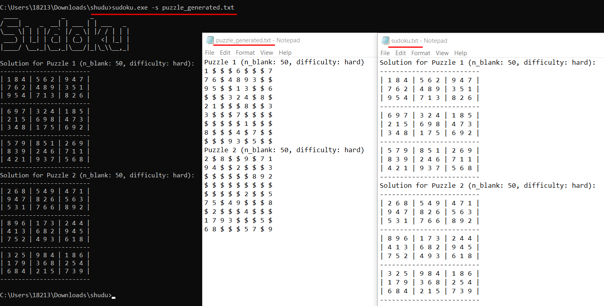
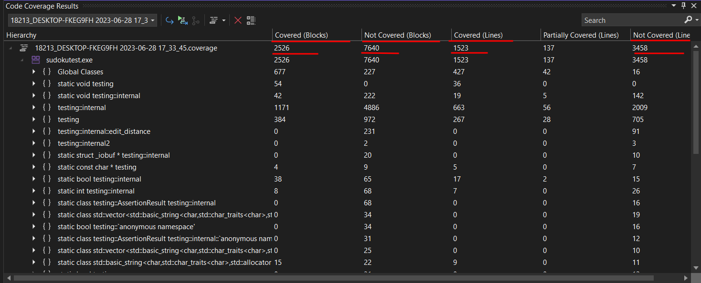

# shudu
NKU software engineering programming assignment.

## 使用方法

### 用法介绍
当无额外输入参数运行程序、用户参数配置错误或参数为`-h`时，程序将打印帮助信息。

具体用法为：


### 生成数独终局
使用参数`-c [n]`生成n个数独终局，n为正常数，不超过1000000。数独终局将在标准输出和文件`finale.txt`中输出。

以生成两个数独终局为例，执行命令
```bash
sudoku.exe -c 2
```
运行结果如下：


### 求解数独游戏
使用参数`-s [file]`求解数独游戏，file为数独游戏文件路径，可输入绝对或相对路径。数独游戏文件格式为：

- 单行纯数字表示一个数独游戏，文件中可多个数独游戏，行间无空格。空白格用`0`或`$`表示，共9*9=81个数字，无空格，如
```
705308000086000007000060090952870604300000109018439702000180023020906070500000008
400200000900041560003680004094000300000000400000493678508706000600000053000520706
415000060920000304700000000070090001000527040509000020006400018000000406200906003
```

- 数独游戏名称单独做行，后接9行数独数字。每个数独游戏间无空格。空白格用`0`或`$`表示，共9*9=81个数字，数字间使用空格分隔，如
```
game1
8 6 7 1 $ $ 2 $ 5
$ $ $ $ 8 $ 1 $ 7
$ $ $ $ $ $ 8 4 $
1 3 $ 6 7 $ $ $ 8
7 $ $ 2 $ 1 $ $ 6
6 $ $ $ 9 8 $ 5 1
$ 7 1 $ $ $ $ $ $
3 $ 2 $ 5 $ $ $ $
5 $ 6 $ $ 2 3 7 9
game2
8 6 7 1 $ $ 2 $ 5
$ $ $ $ 8 $ 1 $ 7
$ $ $ $ $ $ 8 4 $
1 3 $ 6 7 $ $ $ 8
7 $ $ 2 $ 1 $ $ 6
6 $ $ $ 9 8 $ 5 1
$ 7 1 $ $ $ $ $ $
3 $ 2 $ 5 $ $ $ $
5 $ 6 $ $ 2 3 7 9
```

以求解第二种格式的数独游戏为例，读取保存在文件`puzzle_input_fmt2.txt`中的数独游戏，求解结果将保存到`solution.txt`中。执行命令
```bash
sudoku.exe -s puzzle_input_fmt2.txt
```
运行结果如下：


### 生成数独游戏
- 使用参数`-n [n_puzzle]`指定生成数独游戏的数量，n_puzzle为正整数，不超过10000；数独游戏生成结果将保存到文件`puzzle_generated.txt`中。
- 使用参数`-r [n_blank]`指定生成数独游戏的空白格数量，n_blank为正整数，范围在20到55之间。`-r`不能单独使用，必须指定`-n`参数。
- 使用参数`-m [difficulty]`指定生成数独游戏的难度，difficulty为正整数，范围在1到3之间，分别表示简单、中等、困难三种难度。`-m`不能单独使用，必须指定`-n`参数。
- 使用参数`-u`指定生成的数独游戏是否具有唯一解。`-u`不能单独使用，必须指定`-n`参数。对于一个标准的数独游戏，应当具有唯一解，因此建议生成数独游戏时，总是指定该参数。
- `-r`,`-m`,`-u`三个参数可以只使用其中一个或两个，或同时使用。

以生成两个难度为困难、空白格数量为50，具有唯一解的数独游戏为例，执行命令
```bash
sudoku.exe -n 2 -r 50 -m 3 -u
```
运行结果如下：


## 程序设计思路

### 终局生成思路：回溯法

数独游戏的终局生成，本质上是一个空白数独游戏的求解问题。因此，我们可以使用回溯法来解决。按一定顺序或随机选择一个空白格，填入一个数字，然后递归地进行求解，如果求解失败，就回溯到上一步，重新选择数字填入。当所有的空白格都填满时，数独游戏生成成功。

### 数独游戏生成思路：终局生成+挖空
数独游戏生成依赖于回溯法求解。我们首先生成一个数独游戏的终局，然后对终局进行挖空，直到挖空后的数独游戏满足难度要求、唯一性要求和空白格数量要求。

对于难度的设计，参照了综合空白格数量和空格自由度（所有空格所在行、列、块的空格数量）的算法。首先执行预实验，指定随机生成游戏的数量，统计所有空格数对应的空格自由度分布，以空格自由度3:6:11，将难度等级划分为困难、中等、简单。

### 数独求解思路：回溯

用一个数组记录每个数字是否出现。在存储时，我们使用一个长度为9的布尔类型的数组，其中第i 个元素的值为True，当且仅当数字i+1 出现过。

例如我们用 line[2][3]=True表示数字4在第2行已经出现过，那么当我们在遍历到第 2行的空白格时，就不能填入数字4。

我们首先对整个数独数组进行遍历，当我们遍历到第i行第j 列的位置：如果该位置是一个空白格，那么我们将其加入一个用来存储空白格位置的列表中，方便后续的递归操作；如果该位置是一个数字 x，那么我们需要将line[i][x−1]，column[j][x−1] 以及 block[⌊i/3⌋][⌊j/3⌋][x−1] 均置为 True。

当我们结束了遍历过程之后，就可以开始递归枚举。当递归到第i行第j列的位置时，我们枚举填入的数字x根据题目的要求，数字x不能和当前行、列、九宫格中已经填入的数字相同，因此line[i][x−1]，column[j][x−1] 以及block[⌊i/3⌋][⌊j/3⌋][x−1] 必须均为False。

当我们填入了数字 x 之后，我们要将上述的三个值都置为 True，并且继续对下一个空白格位置进行递归。在回溯到当前递归层时，我们还要将上述的三个值重新置为 False。

## 程序测试

### 单元测试
使用Google Test框架进行单元测试，测试用例见`Sudotest/test.cpp`。

#### 测试样例通过截图


#### 覆盖率截图
- 基本块覆盖率：2526/7640 (33.06%)
- 代码行覆盖率：1523/3458 (44.06%)


### 代码质量检查

#### 消除警告
如图，警告代码质量检查，编译时没有报错和警告。
