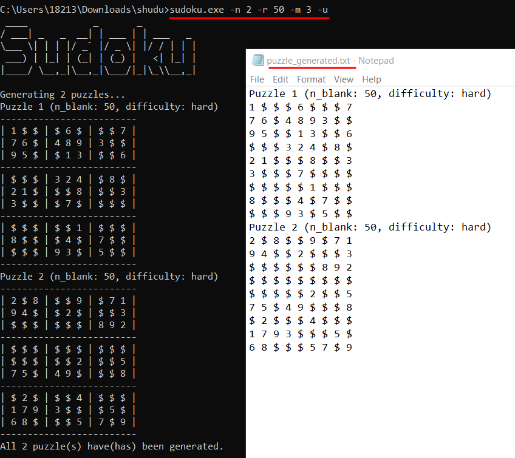

<h2 style="text-align:center">数独游戏用户手册</h2>

<h4 style="text-align:right">郭坤昌 2012522  张朝阳 2011746</h4>

## 一、概述

运行可执行文件`sudoku.exe`开始游戏，具体指令如下：

| 参数格式      | 参数意义                     | 范围限制            |
| :------------ | :--------------------------- | :------------------ |
| -c [数字]     | 生成指定数量的数独终盘       | 1-1000000           |
| -s [文件路径] | 求解指定路径文件中的数独游戏 | 绝对或相对路径      |
| -n [数字]     | 生成指定数量的数独游戏       | 1-10000             |
| -m [数字]     | 生成指定难度的数独游戏       | 1-3，值越大难度越大 |
| -r [数字]     | 生成指定空格数的数独游戏     | 20-55               |
| -u            | 令生成的数独游戏解唯一       |                     |

其中`-r`,`-m`,`-u`三个参数的使用必须指定`-n`参数，且三者可以只使用其中一个或两个，或同时使用。

## 二、生成数独终盘

以生成两个数独终局为例，执行命令

```bash
sudoku.exe -c 2
```

运行结果如下，两个数独终局已生成至根目录下的finale.txt文件中。


## 三、生成数独游戏

生成数独游戏主要涉及到`-n`,`-r`,`-m`,`-u`四个参数的使用，具体描述如下：

- 使用参数`-n [n_puzzle]`指定生成数独游戏的数量，n_puzzle为正整数，不超过10000；数独游戏生成结果将保存到文件`puzzle_generated.txt`中。

- 使用参数`-r [n_blank]`指定生成数独游戏的空白格数量，n_blank为正整数，范围在20到55之间。`-r`不能单独使用，必须指定`-n`参数。

- 使用参数`-m [difficulty]`指定生成数独游戏的难度，difficulty为正整数，范围在1到3之间，分别表示简单、中等、困难三种难度。`-m`不能单独使用，必须指定`-n`参数。

- 使用参数`-u`指定生成的数独游戏是否具有唯一解。`-u`不能单独使用，必须指定`-n`参数。对于一个标准的数独游戏，应当具有唯一解，因此建议生成数独游戏时，总是指定该参数。

以生成两个难度为困难、空白格数量为50，具有唯一解的数独游戏为例，执行命令：

  ```bash
  sudoku.exe -n 2 -r 50 -m 3 -u
  ```

  运行结果如下。生成到`puzzle_generated.txt`文件中的数独游戏以特殊的“游戏名+游戏内容”的格式保存，以下图为例，游戏名为`Puzzle 1 (n_blank: 50, difficulty: hard)`，游戏内容为9行9列的数独游戏，其中空白格用`$`表示。



## 四、求解数独游戏

使用参数`-s [file]`求解数独游戏，file为数独游戏文件路径，可输入绝对或相对路径。这里有两种数独游戏输入的形式可供选择：

1. 一行81个字符，代表一个数独游戏横向逐行展开，不含空格，`$`表示数独游戏中的空白格。该格式是为了方便求解任意数独游戏时的输入。以` puzzle_input_fmt1.txt`中存放数独游戏为例：


2. 数独内容以标准的九宫格排列，格式与三中生成的数独游戏格式一致，数独游戏名称单独做行，后接9行数独数字。每个数独游戏间无空格。空白格用`$`表示，共9*9=81个数字，数字间使用空格分隔。该格式是为了求解程序自身生成的数独游戏。以三中生成的` puzzle_generated.txt`中存放的数独游戏为例：

   


**附：数独游戏github仓库链接：[https://github.com/ZhaoYang0125/shudu](https://github.com/ZhaoYang0125/shudu)**