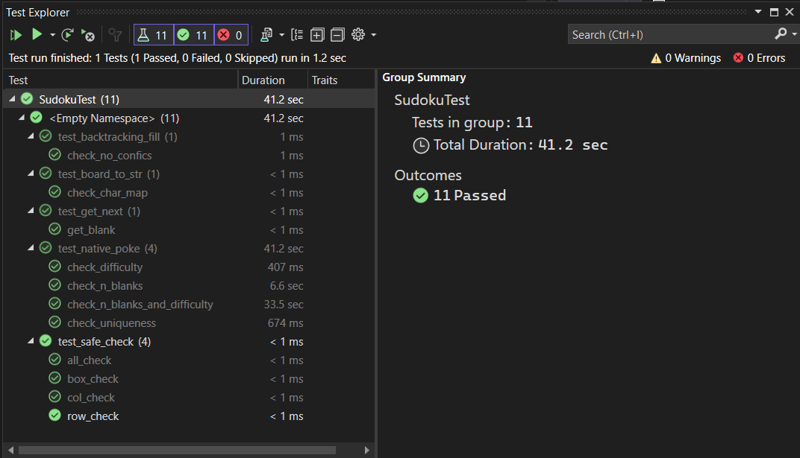
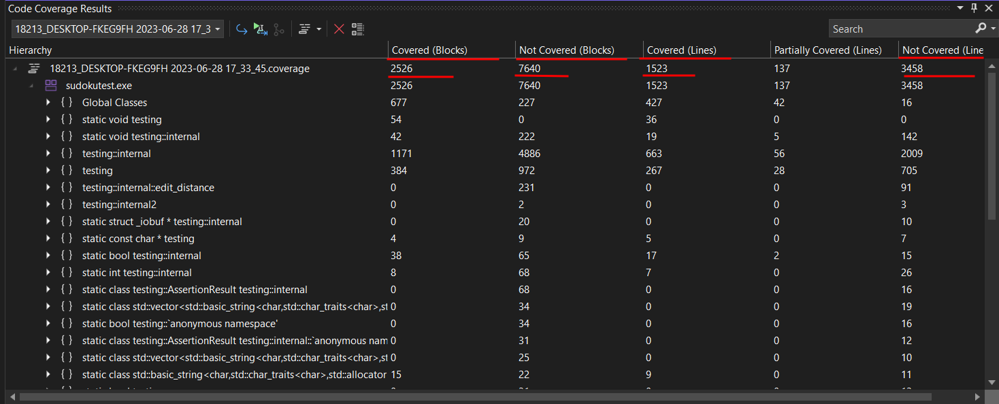
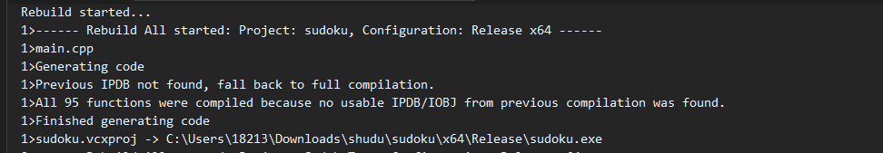

### 单元测试
使用Google Test框架进行单元测试，测试用例详细代码见github仓库中的`Sudotest/test.cpp`。

#### 测试样例通过截图

#### 覆盖率截图
- 基本块覆盖率：2526/7640 (33.06%)
- 代码行覆盖率：1523/3458 (44.06%)

### 代码质量检查

#### 消除警告
如图，警告代码质量检查，编译时没有报错和警告。
